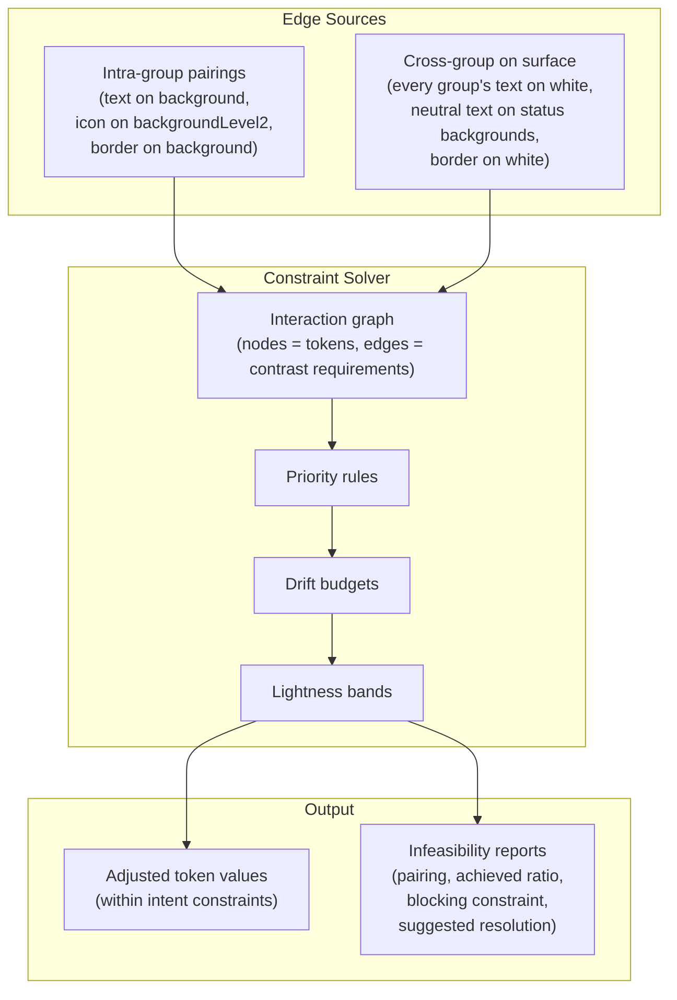

# Intent Optimizer Architecture

Extracted from the [Product & Engineering Brief](BRIEF.md). The optimizer is Engine C in the three-engine architecture — a constraint solver that operates on a graph of token pairings, respects designer intent through drift budgets and lightness bands, and reports infeasibility rather than silently breaking the system. Full colour-science specification: [docs/06-token-intent.md](../docs/06-token-intent.md).

---

## The Problem: White-to-Grey

A naive optimizer treating every token as a free variable will darken `#ffffff` to `#e8e8e8` to satisfy a contrast check against a border. Technically compliant — but the designer's intent was a **white** page surface, and it now looks grey. The same failure appears in reverse: tinted backgrounds (`info.backgroundLevel1 = #e6f1fc`) get their blue tint stripped to meet contrast, becoming indistinguishable from neutral backgrounds. The fix is not better maths — it is knowing what each token is for.

---

## Intent Taxonomy

Every token carries an implicit purpose. The optimizer must respect this purpose when deciding whether and how to adjust a value.

| Intent | Description | Adjustment policy |
|--------|-------------|-------------------|
| **anchor** | Immutable: pure white, pure black, brand colours | Never modify. If a pairing involving an anchor fails, adjust the *other* token. |
| **surface** | Page/section/card backgrounds that must remain near-white (or near-black in inverse) | Minimal drift (max 0.03 L). Prefer adjusting the foreground instead. |
| **container** | Tinted component backgrounds (backgroundLevel1, backgroundLevel2) | Moderate drift (max 0.10 L). Must preserve the tint — chroma and hue must not collapse to grey. |
| **foreground** | Text, icons — the primary contrast lever | Largest drift (max 0.20 L). These absorb most adjustments. |
| **decorative** | Borders, dividers — visual structure, not content | Moderate drift (max 0.15 L). Lower contrast threshold (3:1 instead of 4.5:1). |
| **emphasis** | backgroundBold, base — the key colour defining a status/accent group | Moderate drift (max 0.12 L). Hue is locked — this token *is* the group's identity. |

---

## Lightness Bands and Drift Budgets

Each intent defines a lightness band (OKLCH L range) and a maximum drift from the token's original value. This prevents category drift — a "light tint" can never become a "medium shade".

| Intent | Lightness band | Max drift | Hue locked | Chroma locked |
|--------|---------------|-----------|------------|---------------|
| anchor | frozen | 0 | yes | yes |
| surface (light) | 0.92 – 1.00 | 0.03 | no | if achromatic |
| surface (dark) | 0.10 – 0.22 | 0.03 | no | if achromatic |
| container | 0.75 – 0.94 | 0.10 | no | if achromatic |
| foreground | 0.15 – 0.55 | 0.20 | no | if achromatic |
| decorative | 0.40 – 0.85 | 0.15 | no | if achromatic |
| emphasis | 0.30 – 0.65 | 0.12 | yes | if achromatic |

The effective adjustment range for any token is the intersection of its lightness band and its drift budget from the original value.

---

## Achromatic Detection

A token with OKLCH chroma below 0.04 is classified as **achromatic** — perceived as neutral grey, with the hue angle essentially noise. The optimizer sets `chromaLocked: true` on these tokens to prevent two problems:

1. **Vibrancy injection** — scaling chroma toward `maxChroma(L, H)` on a near-zero-chroma token would introduce visible colour from an arbitrary hue angle.
2. **Tint collapse ambiguity** — desaturating a tinted container past the threshold would permanently reclassify it as achromatic, making the tint unrecoverable.

Classification is based on the token's **original imported value**, not its current optimized state. A safety net in `applyVibrancy` also returns the hex unchanged if current chroma falls below the threshold, protecting tokens without intent metadata.

---

## The Interaction Graph

The optimizer operates on a constraint graph where nodes are tokens and edges are contrast requirements. Edges come from two sources:

**Intra-group pairings** are the baseline: `text` on `background`, `textBold` on `background`, `icon` on `backgroundLevel2`, `border` on `background` (at 3:1). **Cross-group pairings** arise because most backgrounds sit on a page surface — every group's `text` and `base` must pass 4.5:1 against `__white`. Component-derived pairings (cross-group combinations arising from specific UI components) are deferred to a future release — see [docs/06-token-intent.md § Future: User-Defined Component Pairings](../docs/06-token-intent.md#future-user-defined-component-pairings).

---

## Priority Rules

When a pairing fails its contrast threshold, the solver decides which token to adjust using a ranked decision chain:

1. **Never adjust an anchor.** If `white` is one side of a failing pair, adjust the other side.
2. **Prefer adjusting foreground over background.** Text and icons have the widest drift budget and are designed to be contrast-driven.
3. **Prefer the token with more remaining drift budget.** If a foreground has used 0.18 of its 0.20 max drift but a decorative token has only used 0.02 of its 0.15, adjust the decorative token.
4. **Never push a token outside its lightness band.** If adjustment would breach the band, stop at the boundary.
5. **Report infeasibility rather than break intent.** If no adjustment can satisfy the constraint without violating intent, the pairing is flagged — not silently broken.

---

## Infeasibility Reporting

When constraints conflict irreconcilably, the solver reports rather than compromises. Each infeasibility report includes:

- The failing pairing (foreground group/slot, background group/slot)
- The achieved contrast ratio vs. the required threshold
- Which constraint blocked further adjustment (band boundary, max drift, anchor freeze)
- A suggested resolution (e.g. "consider widening the lightness band for container tokens" or "choose a darker base colour for this group")

In the UI, infeasible pairings surface as gentle warnings in the optimizer view — not as blocking errors.

---

## Vibrancy as a Constrained Dimension

The vibrancy slider scales chroma across the system, but intent determines which tokens participate:

| Intent | Participates in vibrancy |
|--------|--------------------------|
| anchor | Never — frozen |
| surface | Never — must remain near-neutral |
| container | Yes — tint intensity scales |
| foreground | Yes — text/icon richness scales |
| decorative | Yes — border richness scales |
| emphasis | Yes — primary vibrancy target |
| any (achromatic) | Never — `chromaLocked` overrides all |

When vibrancy is applied to a container, minimum chroma is clamped to 0.005 so the tint never fully desaturates. This clamp is skipped for achromatic containers so greyscale backgrounds never acquire a tint.
