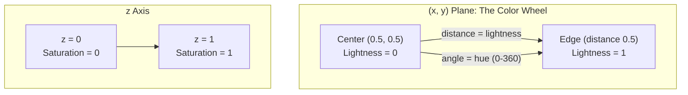
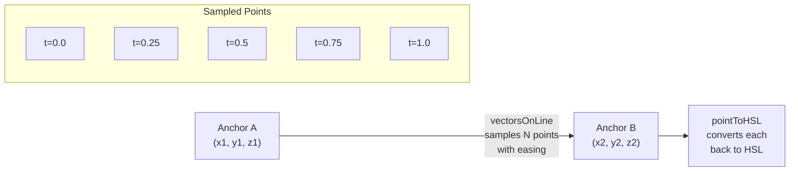

# Poline: Theory and Mechanics

Poline is a color palette generator that takes an unconventional approach: instead of interpolating directly between HSL color values, it maps colors into a custom **polar coordinate space**, draws lines between anchor points in that space, and samples the results back into HSL. Because polar-space straight lines trace curved paths through perceptual color space, the palettes that emerge are richer and more visually harmonious than what naive linear HSL interpolation would produce.

This document explains the theory behind that coordinate mapping, the interpolation engine that draws lines through it, and the easing system that shapes the distribution of colors along those lines.

---

## 1. The Coordinate System: Polar Color Space

At the heart of Poline is a bidirectional mapping between HSL color values and a custom 3D coordinate system `(x, y, z)`.

### The mapping

The coordinate space is a unit cube. The `(x, y)` plane represents a color wheel centered at `(0.5, 0.5)`, while the `z` axis is independent:

| Coordinate | HSL property | How it maps |
|------------|-------------|-------------|
| **angle** from `(0.5, 0.5)` to `(x, y)` | **Hue** (0-360) | `atan2(y - 0.5, x - 0.5)` converted to degrees |
| **distance** from `(0.5, 0.5)` to `(x, y)` | **Lightness** (0-1) | `sqrt((x-0.5)^2 + (y-0.5)^2) / 0.5` |
| **z** | **Saturation** (0-1) | Direct: `z = saturation` |

The center of the wheel `(0.5, 0.5)` has zero distance, meaning zero lightness (black). The rim at distance `0.5` means full lightness (white). Rotating around the center sweeps through all hues.



### XYZ to HSL: `pointToHSL`

This function converts a point in the coordinate space back to an HSL color:

```typescript
export const pointToHSL = (
  xyz: Vector3,
  invertedLightness: boolean
): Vector3 => {
  const [x, y, z] = xyz;
  const cx = 0.5;
  const cy = 0.5;

  // Angle from center determines hue
  const radians = Math.atan2(y - cy, x - cx);
  let deg = radians * (180 / Math.PI);
  deg = (360 + deg) % 360;

  // z coordinate is saturation directly
  const s = z;

  // Distance from center determines lightness
  const dist = Math.sqrt(Math.pow(y - cy, 2) + Math.pow(x - cx, 2));
  const l = dist / cx;

  return [deg, s, invertedLightness ? 1 - l : l];
};
```

The key operations:
- **Hue**: `atan2` gives the angle from center to `(x, y)`, converted from radians to degrees and normalized to `[0, 360)`.
- **Saturation**: read directly from `z`.
- **Lightness**: the Euclidean distance from center `(0.5, 0.5)`, divided by the maximum radius `0.5` to normalize it to `[0, 1]`. The `invertedLightness` flag flips this so center becomes bright and edges become dark.

### HSL to XYZ: `hslToPoint`

The reverse mapping reconstructs Cartesian coordinates from an HSL color:

```typescript
export const hslToPoint = (
  hsl: Vector3,
  invertedLightness: boolean
): Vector3 => {
  const [h, s, l] = hsl;
  const cx = 0.5;
  const cy = 0.5;

  // Hue to angle
  const radians = h / (180 / Math.PI);

  // Lightness to distance from center
  const dist = (invertedLightness ? 1 - l : l) * cx;

  // Polar to Cartesian
  const x = cx + dist * Math.cos(radians);
  const y = cy + dist * Math.sin(radians);

  // Saturation to z directly
  const z = s;

  return [x, y, z];
};
```

This is standard polar-to-Cartesian conversion: the hue becomes an angle, the lightness becomes a radius, and the saturation maps directly to `z`. These two functions are exact inverses of each other -- a round-trip from HSL to XYZ and back (or vice versa) reproduces the original values.

### Inverted lightness

The `invertedLightness` flag reverses the lightness-to-distance relationship. By default, center = dark and edge = light. With `invertedLightness: true`, center = light and edge = dark. This simple `1 - l` flip in both conversion functions creates palettes with a fundamentally different character.

---

## 2. The ColorPoint Class

`ColorPoint` is the internal representation of a single color. It holds both the XYZ position and the HSL color simultaneously, and keeps them in sync through property setters:

```typescript
export class ColorPoint {
  public x = 0;
  public y = 0;
  public z = 0;
  public color: Vector3 = [0, 0, 0];
  private _invertedLightness = false;

  constructor({ xyz, color, invertedLightness = false }: ColorPointCollection = {}) {
    this._invertedLightness = invertedLightness;
    this.positionOrColor({ xyz, color, invertedLightness });
  }

  positionOrColor({ xyz, color, invertedLightness = false }: ColorPointCollection) {
    this._invertedLightness = invertedLightness;
    if ((xyz && color) || (!xyz && !color)) {
      throw new Error("Point must be initialized with either x,y,z or hsl");
    } else if (xyz) {
      this.x = xyz[0]; this.y = xyz[1]; this.z = xyz[2];
      this.color = pointToHSL([this.x, this.y, this.z], invertedLightness);
    } else if (color) {
      this.color = color;
      [this.x, this.y, this.z] = hslToPoint(color, invertedLightness);
    }
  }

  // Setting position recalculates HSL
  set position([x, y, z]: Vector3) {
    this.x = x; this.y = y; this.z = z;
    this.color = pointToHSL([this.x, this.y, this.z], this._invertedLightness);
  }

  // Setting HSL recalculates position
  set hsl([h, s, l]: Vector3) {
    this.color = [h, s, l];
    [this.x, this.y, this.z] = hslToPoint(this.color, this._invertedLightness);
  }

  // ...
}
```

The dual-representation design is central to Poline's architecture: the user thinks in HSL (anchor colors), the interpolation engine works in XYZ (drawing lines), and the output is HSL again. `ColorPoint` bridges these two worlds, ensuring every mutation to one representation immediately updates the other.

A `ColorPoint` must be initialized with **either** an `xyz` position or an HSL `color`, never both and never neither. This constraint ensures there's always a single source of truth at construction time.

---

## 3. Line Interpolation: Drawing Lines in Color Space

The core of palette generation is interpolating points along line segments between anchor positions in the XYZ coordinate space.

### Interpolating a single point: `vectorOnLine`

Given two 3D endpoints, a parameter `t` in `[0, 1]`, and easing functions for each axis, `vectorOnLine` computes the interpolated position:

```typescript
const vectorOnLine = (
  t: number,
  p1: Vector3,
  p2: Vector3,
  invert = false,
  fx = (t: number, invert: boolean): number => (invert ? 1 - t : t),
  fy = (t: number, invert: boolean): number => (invert ? 1 - t : t),
  fz = (t: number, invert: boolean): number => (invert ? 1 - t : t)
): Vector3 => {
  const tModifiedX = fx(t, invert);
  const tModifiedY = fy(t, invert);
  const tModifiedZ = fz(t, invert);
  const x = (1 - tModifiedX) * p1[0] + tModifiedX * p2[0];
  const y = (1 - tModifiedY) * p1[1] + tModifiedY * p2[1];
  const z = (1 - tModifiedZ) * p1[2] + tModifiedZ * p2[2];

  return [x, y, z];
};
```

Each axis gets its own easing function (`fx`, `fy`, `fz`). The raw parameter `t` is passed through the easing function first, producing a modified `tModified` value. The interpolation formula itself is standard linear interpolation: `(1 - tModified) * start + tModified * end`.

When all three easing functions are the same, the path between the two endpoints is a straight line in XYZ space (just with non-uniform point spacing). When different functions are used per axis, the eased `t` values differ across dimensions, causing the interpolated point to deviate from the straight line -- the path becomes a **3D curve**.

### Sampling multiple points: `vectorsOnLine`

`vectorsOnLine` samples `numPoints` evenly-spaced `t` values along a segment:

```typescript
const vectorsOnLine = (
  p1: Vector3, p2: Vector3,
  numPoints = 4, invert = false,
  fx, fy, fz
): Vector3[] => {
  const points: Vector3[] = [];
  for (let i = 0; i < numPoints; i++) {
    const [x, y, z] = vectorOnLine(
      i / (numPoints - 1),    // evenly spaced t values
      p1, p2, invert, fx, fy, fz
    );
    points.push([x, y, z]);
  }
  return points;
};
```

The parameter `t` ranges from `0` (at `p1`) to `1` (at `p2`), with `numPoints` samples in between. Each sampled XYZ position is later converted back to HSL via `ColorPoint`, completing the pipeline from anchor colors to palette colors.

### Why this produces interesting palettes

The crucial insight is that interpolation happens in **polar coordinate space**, not in HSL directly. A straight line between two points in `(x, y, z)` space traces a path that, when converted back to HSL, follows a smooth arc through hue, sweeps through lightness in proportion to radial movement, and transitions saturation linearly. The result is palettes that feel more natural and harmonious than what you get from linearly interpolating H, S, and L independently.



---

## 4. Position (Easing) Functions

Position functions control **how colors are distributed** along the path between anchors. They behave like animation easing functions: each maps a linear input `t` in `[0, 1]` to an output in `[0, 1]`, reshaping the spacing of sampled points.

### Function signature

All position functions share the same type:

```typescript
type PositionFunction = (t: number, reverse?: boolean) => number;
```

The `reverse` parameter mirrors the function (producing `1 - f(1 - t)`) so that alternating segments can use complementary easings.

### Available functions

| Function | Formula | Character |
|----------|---------|-----------|
| `linearPosition` | `t` | Even spacing |
| `sinusoidalPosition` (default) | `sin(t * PI/2)` | Smooth ease-out, colors cluster near start |
| `exponentialPosition` | `t^2` | Accelerating, colors cluster near start |
| `quadraticPosition` | `t^3` | Stronger acceleration |
| `cubicPosition` | `t^4` | Even stronger acceleration |
| `quarticPosition` | `t^5` | Extreme acceleration |
| `asinusoidalPosition` | `asin(t) / (PI/2)` | Ease-in, inverse of sinusoidal |
| `arcPosition` | `1 - sqrt(1 - t)` | Circular ease-out |
| `smoothStepPosition` | `t^2 * (3 - 2*t)` | Smooth S-curve, ease-in-out |

### Key implementations

The default sinusoidal easing and the smooth step function illustrate the two main styles:

```typescript
const sinusoidalPosition: PositionFunction = (t: number, reverse = false) => {
  if (reverse) {
    return 1 - Math.sin(((1 - t) * Math.PI) / 2);
  }
  return Math.sin((t * Math.PI) / 2);
};

const smoothStepPosition: PositionFunction = (t: number) => {
  return t ** 2 * (3 - 2 * t);
};
```

Sinusoidal easing starts fast and decelerates (ease-out). Its reverse starts slow and accelerates (ease-in). Smooth step provides a symmetric S-curve that eases both in and out.

### Per-axis easing and 3D curves

Each of the three interpolation axes (X, Y, Z) can use a **different** easing function. When they differ, the eased `t` values diverge across dimensions at any given sample point, pulling the interpolated position off the straight line and into a curve.

For example, if X uses sinusoidal easing while Y uses linear and Z uses exponential, the X coordinate will race ahead of Y while Z lags behind -- the path bows out into a curve through the 3D space, producing a more varied hue/lightness/saturation journey than a straight line would.

### Segment inversion and S-curves

When a palette has multiple anchor pairs (segments), Poline alternates the easing direction on odd-numbered segments via `shouldInvertEaseForSegment`:

```typescript
private shouldInvertEaseForSegment(segmentIndex: number): boolean {
  return !!(
    segmentIndex % 2 ||
    (this.connectLastAndFirstAnchor &&
      this.anchorPoints.length === 2 &&
      segmentIndex === 0)
  );
}
```

Odd segments use the `reverse` form of the easing function. This creates a smooth handoff at anchor boundaries: if segment 0 decelerates into an anchor, segment 1 accelerates away from it, forming a natural S-curve across the full palette. Without this alternation, consecutive segments would both start slow (or both start fast), creating a jarring discontinuity in color density at each anchor.

---

## 5. The Poline Orchestrator

The `Poline` class ties together the coordinate system, color points, interpolation, and easing into a single palette engine.

### Construction

```typescript
constructor({
  anchorColors = randomHSLPair(),
  numPoints = 4,
  positionFunction = sinusoidalPosition,
  positionFunctionX, positionFunctionY, positionFunctionZ,
  closedLoop, invertedLightness, clampToCircle,
}: PolineOptions = {}) {
  // Convert anchor HSL colors into ColorPoint objects
  this._anchorPoints = anchorColors.map(
    (point) => new ColorPoint({ color: point, invertedLightness })
  );

  // numPoints is the user-facing count; internally, +2 accounts for the
  // anchor endpoints themselves
  this._numPoints = numPoints + 2;

  // Store easing functions (per-axis or shared)
  this._positionFunctionX = positionFunctionX || positionFunction || sinusoidalPosition;
  this._positionFunctionY = positionFunctionY || positionFunction || sinusoidalPosition;
  this._positionFunctionZ = positionFunctionZ || positionFunction || sinusoidalPosition;

  // Generate the palette
  this.updateAnchorPairs();
}
```

If no anchor colors are provided, `randomHSLPair()` generates two random anchors with hues offset by 60-240 degrees, high saturation, and contrasting lightness -- a good default for visually interesting palettes.

### The generation pipeline: `updateAnchorPairs`

This is the method that generates the full palette whenever any parameter changes:

```typescript
public updateAnchorPairs(): void {
  this._anchorPairs = [];

  // If closed loop, connect last anchor back to first
  const anchorPointsLength = this.connectLastAndFirstAnchor
    ? this.anchorPoints.length
    : this.anchorPoints.length - 1;

  // Build consecutive pairs
  for (let i = 0; i < anchorPointsLength; i++) {
    const pair = [
      this.anchorPoints[i],
      this.anchorPoints[(i + 1) % this.anchorPoints.length],
    ];
    this._anchorPairs.push(pair);
  }

  // Interpolate points along each pair
  this.points = this._anchorPairs.map((pair, i) => {
    const p1position = pair[0].position;
    const p2position = pair[1].position;

    const shouldInvertEase = this.shouldInvertEaseForSegment(i);

    return vectorsOnLine(
      p1position, p2position,
      this._numPoints,
      shouldInvertEase,
      this.positionFunctionX,
      this.positionFunctionY,
      this.positionFunctionZ
    ).map(
      (p) => new ColorPoint({ xyz: p, invertedLightness: this._invertedLightness })
    );
  });
}
```

The method:
1. Forms pairs of consecutive anchors (with wrap-around if `closedLoop` is on).
2. For each pair, calls `vectorsOnLine` to sample `numPoints + 2` positions in XYZ space, applying the per-axis easing functions with appropriate inversion for the segment.
3. Wraps each sampled XYZ position in a `ColorPoint`, which converts it back to HSL.

### Deduplication: `flattenedPoints`

Because each segment includes its endpoints (the anchors), adjacent segments share a point at the boundary. The `flattenedPoints` getter flattens all segments and removes these duplicates:

```typescript
public get flattenedPoints() {
  return this.points
    .flat()
    .filter((p, i) => (i != 0 ? i % this._numPoints : true));
}
```

The filter keeps the first point unconditionally, then skips every point whose flat index is a multiple of `_numPoints` -- these are the anchor points at the start of each subsequent segment (which duplicate the end of the previous segment).

### Closed loops

When `closedLoop` is `true`, `updateAnchorPairs` creates an additional segment connecting the last anchor back to the first. For the output, the final duplicate color (which would be the same as the first) is removed via `colors.pop()`, giving a seamless cyclical palette.

### Continuous sampling: `getColorAt`

For use cases like animation or gradient generation, `getColorAt(t)` provides continuous sampling at any position `t` in `[0, 1]` across the entire palette:

```typescript
public getColorAt(t: number): ColorPoint {
  // Map global t to segment index + local t
  const totalSegments = this.connectLastAndFirstAnchor
    ? this.anchorPoints.length
    : this.anchorPoints.length - 1;

  const segmentPosition = t * totalSegments;
  const segmentIndex = Math.floor(segmentPosition);
  const localT = segmentPosition - segmentIndex;

  // Clamp at boundaries
  const actualSegmentIndex = segmentIndex >= totalSegments
    ? totalSegments - 1 : segmentIndex;
  const actualLocalT = segmentIndex >= totalSegments ? 1 : localT;

  // Interpolate within the segment using the same easing as the batch pipeline
  const pair = this._anchorPairs[actualSegmentIndex];
  const shouldInvertEase = this.shouldInvertEaseForSegment(actualSegmentIndex);

  const xyz = vectorOnLine(
    actualLocalT,
    pair[0].position, pair[1].position,
    shouldInvertEase,
    this._positionFunctionX,
    this._positionFunctionY,
    this._positionFunctionZ
  );

  return new ColorPoint({ xyz, invertedLightness: this._invertedLightness });
}
```

This maps the global `t` to a specific segment and a local `t` within that segment, then uses the same `vectorOnLine` and easing logic as the batch generation pipeline. The result is a continuous, easing-respecting color at any arbitrary position.

### Hue shifting

`shiftHue` rotates the hue of every anchor by a given angle, then regenerates the palette:

```typescript
public shiftHue(hShift = 20): void {
  this.anchorPoints.forEach((p) => p.shiftHue(hShift));
  this.updateAnchorPairs();
}
```

Because the anchors' XYZ positions are recalculated from their shifted HSL values (via `ColorPoint.shiftHue`), the entire interpolation path rotates coherently around the color wheel.

---

## 6. The Full Pipeline

```mermaid
flowchart TD
  input["User provides anchor colors<br/>[h, s, l] arrays"] --> convert["hslToPoint()<br/>converts each anchor<br/>to (x, y, z)"]
  convert --> colorpoint["Wrapped in ColorPoint<br/>objects (dual HSL + XYZ)"]
  colorpoint --> pairs["Consecutive anchors<br/>form pairs"]
  pairs --> interpolate["vectorsOnLine()<br/>samples N points per pair"]
  
  easing["Position functions<br/>(per-axis easing)"] --> interpolate
  invert["shouldInvertEaseForSegment()<br/>alternates direction"] --> interpolate
  
  interpolate --> xyzPoints["Sampled (x, y, z) points"]
  xyzPoints --> backConvert["pointToHSL()<br/>converts each point<br/>back to HSL"]
  backConvert --> flatten["flattenedPoints<br/>deduplicates shared<br/>anchor boundaries"]
  flatten --> output["Output"]
  
  output --> hsl["colors<br/>[h, s, l] arrays"]
  output --> css["colorsCSS<br/>CSS hsl() strings"]
  output --> lch["colorsCSSlch<br/>CSS lch() strings"]
  output --> oklch["colorsCSSoklch<br/>CSS oklch() strings"]
```

The pipeline flows in a single direction:

1. **Input**: The user provides anchor colors as HSL arrays (or lets Poline generate a random pair).
2. **HSL to XYZ**: Each anchor is converted to a position in the polar coordinate space via `hslToPoint`.
3. **Pairing**: Consecutive anchors are grouped into pairs (with wrap-around for closed loops).
4. **Interpolation**: `vectorsOnLine` samples `N` points along the line between each pair's XYZ positions, shaped by per-axis easing functions with alternating inversion.
5. **XYZ to HSL**: Each sampled point is converted back to an HSL color via `pointToHSL` (inside `ColorPoint`).
6. **Deduplication**: `flattenedPoints` removes the shared anchor points at segment boundaries.
7. **Output**: The palette is available as raw HSL arrays, CSS HSL strings, or approximate CSS LCH/OKLCH strings.

Every mutable property on the `Poline` class -- `numPoints`, `positionFunction`, `closedLoop`, `invertedLightness`, `anchorPoints` -- triggers `updateAnchorPairs()` on change, regenerating the full palette from scratch. This ensures the output is always consistent with the current configuration.
