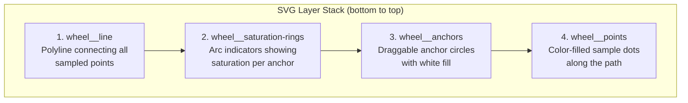
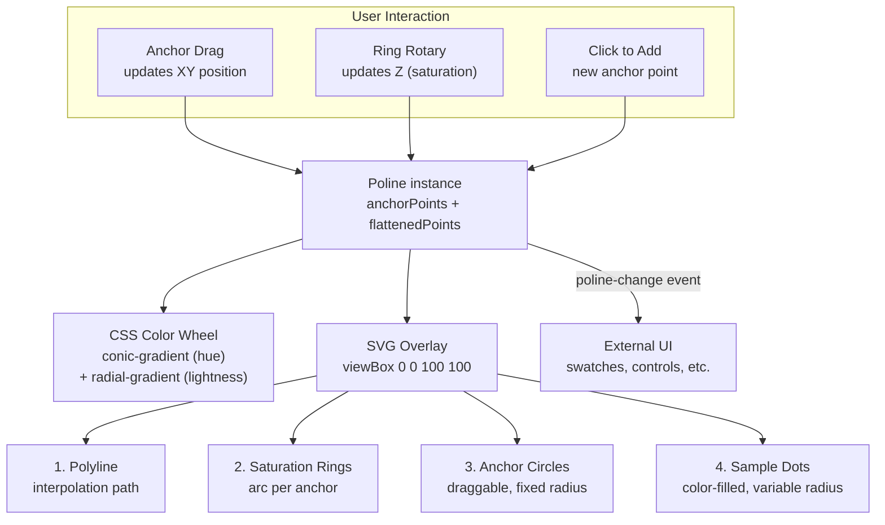

# Poline Visualization: How Palettes Are Rendered

[THEORY.md](THEORY.md) explains how Poline generates color palettes by drawing lines through a polar coordinate space. This document covers the other half of the story: how those palettes are **visually rendered and interacted with** through the `<poline-picker>` web component defined in `src/webcomponent.ts`.

The picker is a custom HTML element that composites a CSS color wheel background with an SVG overlay containing the interpolation path, anchor handles, sample dots, and saturation ring controls. It supports drag-based anchor repositioning, rotary saturation adjustment, and emits change events for integration with surrounding UI.

---

## 1. The Color Wheel Background (CSS)

The color wheel is constructed entirely from CSS gradients on a `::before` pseudo-element. No images or canvas rendering are involved.

### Two-layer gradient composition

```css
.picker::before {
  content: '';
  position: absolute;
  inset: 0;
  border-radius: 50%;
  background:
    radial-gradient(closest-side, var(--minL), rgba(255, 255, 255, 0), var(--maxL)),
    conic-gradient(from 90deg, var(--grad));
  z-index: 1;
}
```

The background is a stack of two gradients:

**Layer 1 (bottom): Conic hue gradient.** A `conic-gradient` that sweeps through all hues at fixed saturation and lightness. Six HSL stops are placed at 60-degree intervals (0, 60, 120, 180, 240, 300, 360), forming a continuous hue ring. The saturation and lightness of the wheel itself are configurable via CSS custom properties:

```css
--wheelS: var(--poline-picker-wheel-saturation, .4);
--wheelL: var(--poline-picker-wheel-lightness, .5);
```

**Layer 2 (top): Radial lightness gradient.** A `radial-gradient` that fades from `--minL` (dark) at the center, through transparent in the middle, to `--maxL` (light) at the edge. This simulates the lightness dimension of Poline's polar coordinate system, where distance from center corresponds to lightness.

The container uses `border-radius: 50%` to clip both gradients into a circle, and `aspect-ratio: 1` to maintain square proportions at any size.

### Inverted lightness

The `updateLightnessBackground()` method swaps the radial gradient direction by flipping the CSS custom properties:

```typescript
private updateLightnessBackground() {
  const picker = this.shadowRoot?.querySelector(".picker") as HTMLElement;
  if (picker && this.poline) {
    if (this.poline.invertedLightness) {
      picker.style.setProperty("--maxL", "#000");
      picker.style.setProperty("--minL", "#fff");
    } else {
      picker.style.setProperty("--maxL", "#fff");
      picker.style.setProperty("--minL", "#000");
    }
  }
}
```

When `invertedLightness` is true, center becomes bright (white) and edge becomes dark -- matching the inverted lightness mapping in the generation engine.

---

## 2. The SVG Overlay: Layer Architecture

Positioned above the CSS wheel at `z-index: 2`, an SVG element with `viewBox="0 0 100 100"` hosts all interactive and decorative elements. The SVG uses a 100x100 coordinate space (set by the `svgscale` constant) for clean, resolution-independent rendering.

Inside the root `<g class="wheel">` group, four layers are rendered in order from bottom to top:

```xml
<g class="wheel">
  <polyline class="wheel__line" points="" />
  <g class="wheel__saturation-rings"></g>
  <g class="wheel__anchors"></g>
  <g class="wheel__points"></g>
</g>
```



This ordering ensures the interpolation path sits behind everything, saturation rings frame the anchor handles, and sample dots render on top so their colors are always visible.

---

## 3. Coordinate Mapping: XYZ to SVG

Poline's internal coordinate system uses normalized values in the `[0, 1]` range. The `pointToCartesian()` method maps these to SVG viewport coordinates in the `[0, 100]` range:

```typescript
private pointToCartesian(point: ColorPoint): [number, number] {
  const half = svgscale / 2;  // 50
  const x = half + (point.x - 0.5) * svgscale;
  const y = half + (point.y - 0.5) * svgscale;
  return [x, y];
}
```

The mapping is a simple scale-and-offset: the Poline center `(0.5, 0.5)` maps to SVG center `(50, 50)`, and the full `[0, 1]` range maps to `[0, 100]`. This preserves the geometric relationships from the polar coordinate system -- angles and relative distances are identical in both spaces.

The reverse mapping, used for pointer input, is handled by `pointerToNormalizedCoordinates()`:

```typescript
private pointerToNormalizedCoordinates(e: PointerEvent) {
  const svgRect = this.svg.getBoundingClientRect();
  const svgX = ((e.clientX - svgRect.left) / svgRect.width) * svgscale;
  const svgY = ((e.clientY - svgRect.top) / svgRect.height) * svgscale;
  return {
    normalizedX: svgX / svgscale,
    normalizedY: svgY / svgscale,
  };
}
```

This converts screen pixel coordinates (from `PointerEvent.clientX/Y`) to the `[0, 1]` normalized range via the SVG element's bounding rect.

---

## 4. Rendering the Palette: `updateSVG()`

The `updateSVG()` method is the main render function, called whenever the palette data changes. It redraws all four SVG layers in sequence.

### Step 1: Path line

The flattened points from the Poline instance are mapped to Cartesian SVG coordinates and joined into a polyline `points` attribute:

```typescript
const flattenedPoints = this.poline.flattenedPoints;
const pathPoints = flattenedPoints
  .map((p) => {
    const cartesian = this.pointToCartesian(p);
    if (!cartesian) return "";
    const [x, y] = cartesian;
    return `${x},${y}`;
  })
  .filter((point) => point !== "")
  .join(" ");

this.line.setAttribute("points", pathPoints);
```

This produces a thin, unfilled polyline tracing the interpolation path across the color wheel.

### Step 2: Saturation rings

`this.updateSaturationRings()` is called to redraw the arc indicators around each anchor (covered in detail in the next section).

### Step 3: Anchor circles

Anchor points are drawn as circles with a fixed radius of `UI_METRICS.anchorRadius` (2 SVG units), a white fill, and a dark stroke:

```typescript
updateCircles(
  this.anchors,
  this.poline.anchorPoints,
  "wheel__anchor",
  () => UI_METRICS.anchorRadius  // constant radius: 2
);
```

### Step 4: Sample point circles

All sampled points (the palette colors) are drawn as smaller circles whose radius varies with saturation. Higher saturation produces a larger dot:

```typescript
updateCircles(
  this.points,
  flattenedPoints,
  "wheel__point",
  (p) => 0.5 + p.color[1]  // radius = 0.5 + saturation (0-1)
);
```

Each dot is filled with its actual color via `point.hslCSS`, so the dots directly show the palette colors at their positions on the wheel.

### Efficient DOM recycling

The `updateCircles` helper avoids recreating SVG elements on every render. It compares the existing children in a container with the new data, reuses elements that already exist (just updating their attributes), creates new ones only when needed, and removes excess elements when the count shrinks:

```typescript
const updateCircles = (container, points, className, radiusFn) => {
  const existing = container.children;

  // Remove excess elements
  while (existing.length > points.length) {
    const last = existing[existing.length - 1];
    if (last) container.removeChild(last);
  }

  points.forEach((point, i) => {
    let circle = existing[i] as SVGCircleElement;
    // ...calculate position, radius, fill...

    if (!circle) {
      circle = document.createElementNS(namespaceURI, "circle");
      circle.setAttribute("class", className);
      container.appendChild(circle);
    }

    circle.setAttribute("cx", x.toString());
    circle.setAttribute("cy", y.toString());
    circle.setAttribute("r", r.toString());
    circle.setAttribute("fill", fill);
  });
};
```

This recycling pattern is critical for performance during drag interactions, where `updateSVG()` fires on every pointer move event.

---

## 5. Saturation Rings

Each anchor point is surrounded by a ring that visually encodes its saturation value as an arc. The `updateSaturationRings()` method manages these, and the `describeArc()` helper generates the SVG path data.

### Ring group structure

Each anchor's ring is a group of three SVG elements:

1. **Background circle** (`wheel__ring-bg`): a full circle that provides visual context on hover.
2. **Saturation arc** (`wheel__saturation-ring`): an SVG `<path>` arc whose length is proportional to the saturation value.
3. **Tick mark** (`wheel__ring-tick`): a short radial line at the arc endpoint, pointing outward.

The arc starts at 12 o'clock (`-PI/2`) and sweeps clockwise by `saturation * 2*PI` radians. A saturation of 0.5 produces a half-circle arc; 1.0 produces a full ring:

```typescript
const startAngle = -Math.PI / 2;
const endAngle = startAngle + saturation * Math.PI * 2;
const arcPath = this.describeArc(cx, cy, ringRadius, startAngle, endAngle);
```

The ring radius is computed as `anchorRadius + ringGap + 1` (2 + 0.5 + 1 = 3.5 SVG units from center), placing it just outside the anchor circle.

### The `describeArc` helper

SVG arc commands cannot draw from a point to itself (a full circle), so `describeArc` handles three cases:

```typescript
private describeArc(cx, cy, r, startAngle, endAngle): string {
  const angleDiff = endAngle - startAngle;

  // Near-zero: don't draw anything
  if (Math.abs(angleDiff) < 0.001) {
    return "";
  }

  // Near-full-circle: draw two half-circle arcs
  if (Math.abs(angleDiff) > Math.PI * 2 - 0.01) {
    const midAngle = startAngle + Math.PI;
    const startX = cx + r * Math.cos(startAngle);
    const startY = cy + r * Math.sin(startAngle);
    const midX = cx + r * Math.cos(midAngle);
    const midY = cy + r * Math.sin(midAngle);
    return `M ${startX} ${startY} A ${r} ${r} 0 1 1 ${midX} ${midY} A ${r} ${r} 0 1 1 ${startX} ${startY}`;
  }

  // Normal case: single arc with large-arc flag
  const startX = cx + r * Math.cos(startAngle);
  const startY = cy + r * Math.sin(startAngle);
  const endX = cx + r * Math.cos(endAngle);
  const endY = cy + r * Math.sin(endAngle);
  const largeArc = angleDiff > Math.PI ? 1 : 0;
  const sweep = 1;  // clockwise

  return `M ${startX} ${startY} A ${r} ${r} 0 ${largeArc} ${sweep} ${endX} ${endY}`;
}
```

### Visibility and responsiveness

Rings are hidden entirely on touch devices (where the rotary gesture would be impractical):

```css
@media (pointer: coarse) {
  .wheel__ring-group {
    display: none;
  }
}
```

The tick mark and background circle start with `opacity: 0` and only become visible when the ring group has the `--hover` modifier:

```css
.wheel__ring-group--hover .wheel__ring-tick { opacity: 1; }
.wheel__ring-group--hover .wheel__ring-bg { opacity: 1; }
```

---

## 6. Interaction Model

Three pointer event handlers (`handlePointerDown`, `handlePointerMove`, `handlePointerUp`) drive all interactivity. They are attached to the SVG element when the `interactive` attribute is present on the `<poline-picker>`.

### Anchor dragging

On pointer down, the component checks if the click lands near an existing anchor using Poline's `getClosestAnchorPoint` with a tight `maxDistance` of `0.05`:

```typescript
const closestAnchor = this.poline.getClosestAnchorPoint({
  xyz: [normalizedX, normalizedY, null],
  maxDistance: 0.05,
});

if (closestAnchor) {
  this.currentPoint = closestAnchor;
}
```

During subsequent pointer moves, the grabbed anchor's XY position is updated while preserving its Z (saturation):

```typescript
this.poline.updateAnchorPoint({
  point: this.currentPoint,
  xyz: [normalizedX, normalizedY, this.currentPoint.z],
});
this.updateSVG();
this.dispatchPolineChange();
```

If `allow-add-points` is set and no existing anchor is hit, a new anchor is created at the click position.

### Saturation ring adjustment (rotary control)

The `pickRing()` method determines if the pointer is in the annular "ring zone" around any anchor -- the area between `anchorRadius` (2) and `ringOuterRadius` (5) SVG units from the anchor center:

```typescript
private pickRing(normalizedX: number, normalizedY: number): number | null {
  // ...
  const dist = Math.hypot(svgX - cx, svgY - cy);
  if (dist > UI_METRICS.anchorRadius && dist <= UI_METRICS.ringOuterRadius) {
    return i;  // anchor index
  }
  // ...
}
```

When a ring is grabbed, the component enters rotary adjustment mode. As the pointer moves, the angular displacement around the anchor center is accumulated:

```typescript
let dA = curAngle - this.ringAdjust.prevAngle;
if (dA > Math.PI) dA -= Math.PI * 2;
else if (dA < -Math.PI) dA += Math.PI * 2;

this.ringAdjust.accumulatedAngle += dA;
this.ringAdjust.prevAngle = curAngle;
```

The accumulated angle is converted to a saturation delta. One full turn (`2*PI`) maps to the full saturation range by default. Holding Shift slows the sensitivity to 2.5 turns for full range:

```typescript
const turns = this.ringAdjust.accumulatedAngle / (Math.PI * 2);
const turnsToFull = e.shiftKey ? ROTARY_TURNS_TO_FULL_SHIFT : ROTARY_TURNS_TO_FULL;
const deltaSat = turns / turnsToFull;

let newSaturation = this.clamp01(this.ringAdjust.startSaturation + deltaSat);
```

A bound-clamping reset mechanism prevents dead zones at 0 and 1: when the value hits a bound and the user continues turning in the same direction, the baseline is reset so that reversing direction immediately begins moving the value back.

### Hover feedback

On non-touch devices, `handlePointerMove` continuously checks for ring hover via `pickRing()`. When the pointer enters a ring zone, the `ring-hover` class is toggled on the host element, changing the cursor to `ew-resize`:

```css
:host(.ring-hover) svg { cursor: ew-resize; }
:host(.ring-adjusting) svg { cursor: grabbing; }
```

### Event dispatch

Every mutation (anchor drag, saturation change, or point addition) emits a `poline-change` CustomEvent containing the Poline instance:

```typescript
private dispatchPolineChange() {
  this.dispatchEvent(
    new CustomEvent("poline-change", {
      detail: { poline: this.poline },
    })
  );
}
```

Consuming code listens for this event to update external UI (color swatches, code previews, etc.) in response to user interaction.

---

## 7. The Demo Page

`dist/picker.html` provides a full working integration of the `<poline-picker>` component. It demonstrates:

- **Control panel**: sliders and checkboxes for `numPoints`, `invertedLightness`, and `closedLoop`; dropdown selects for per-axis position functions (X, Y, Z).
- **Color swatch bars**: three rows of rectangular swatches below the wheel, rendering the palette in HSL, OKLCH, and LCH CSS formats.
- **Randomize button**: randomizes anchor hues and saturations while preserving lightness.
- **Keyboard shortcuts**:
  - `P` -- add a new anchor at the current cursor position
  - `Backspace` / `Delete` -- remove the last selected anchor (minimum 2)
  - `Arrow Left` / `Arrow Right` -- shift all hues by 4 degrees

The demo listens for the `poline-change` event to synchronize swatches with the wheel:

```javascript
picker.addEventListener("poline-change", updateColors);
```

---

## 8. Summary: The Visualization Pipeline



The visualization is a two-layer composite:

1. **CSS layer**: a static color wheel that provides spatial context (hue by angle, lightness by distance from center).
2. **SVG layer**: a dynamic overlay that renders the current palette state (path, anchors, samples, saturation arcs) and handles all user interaction.

Every user gesture mutates the underlying Poline instance, which triggers `updateSVG()` to re-render the SVG layer and emits a `poline-change` event for external consumers. The CSS wheel only needs updating when the `invertedLightness` flag changes.
