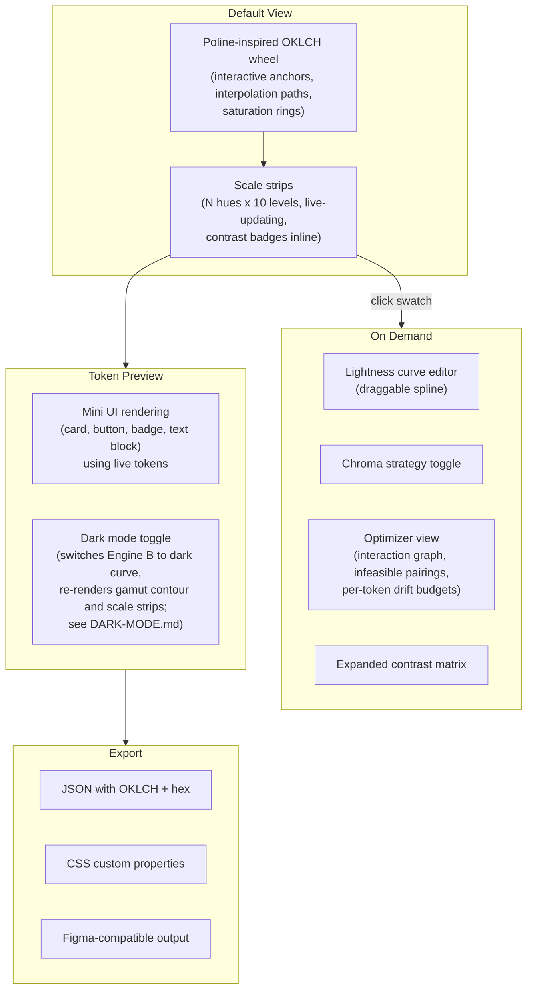

# Colour System Visualizer — Product & Engineering Brief

> **Archived.** This is the V1 product brief, preserved for historical context. Many internal links reference files that were removed during the V2 reorganization (poline/, components/, planning docs). See [V2-PRODUCT.md](V2-PRODUCT.md) for the current roadmap.

An ultra-minimalist, toy-like web tool that helps designers build beautiful, accessible colour token systems through direct manipulation.

---

## Vision

Fuse the playful, gesture-driven interpolation of [Poline's polar coordinate engine](poline/THEORY.md) with a rigorous [OKLCH-native colour science pipeline](docs/05-generation-algorithm.md) to create a tool where dragging a single anchor point materializes a complete, WCAG-validated token system in real time. The interface should feel like a toy — spring-physics interactions, ambient feedback, zero configuration — while producing production-grade design tokens that are both aesthetically harmonious and structurally accessible.

---

## User Story (6P)

Following the [6P Story Framework](frameworks/FRAMEWORK_6P-Story.md):

| Panel | Moment |
|-------|--------|
| **1 — Exposition** | A designer has a brand colour and needs a full token system. They're staring at a spreadsheet of hex values, uncertain whether their picks actually work together or pass accessibility. |
| **2 — Trigger** | They try existing tools: contrast checkers that are purely scientific but joyless, or palette generators that look beautiful but have no gamut or accessibility awareness. |
| **3 — Struggle** | They toggle between tabs, manually cross-check contrast ratios, lose track of which combinations work. Every change to one swatch cascades into manual rechecks across the whole system. |
| **4 — Doubt** | "Is there a better way, or is colour system design just inherently tedious?" |
| **5 — Action** | They open this tool, drop in a seed colour, and drag. The entire token system — scales, pairings, contrast relationships — comes to life instantly. The system gently guides them when something breaks accessibility. |
| **6 — Resolution** | They export tokens that are both beautiful and bulletproof. The system they built feels like *theirs* — crafted, not generated. |

**Aha moment:** The instant a complete, valid colour system materializes from a single gesture. Time-to-value target: under 3 seconds.

---

## Core Concept: Three Engines

### Engine A — Poline's Polar Interpolation (the toy layer)

Adapted from [poline/THEORY.md](poline/THEORY.md). Straight lines in a custom polar coordinate space trace curved, harmonious paths through colour space. The draggable colour wheel with anchor points, interpolation paths, and saturation rings is inherently playful — physical and immediate. The interaction model (drag anchors, rotate saturation rings, watch paths arc across a wheel) creates the "toy" feeling.

### Engine B — OKLCH Scale Engine (the truth layer)

Defined across [docs/01-oklch-colour-model.md](docs/01-oklch-colour-model.md) through [docs/05-generation-algorithm.md](docs/05-generation-algorithm.md). A generation pipeline: target lightness curve, per-hue gamut boundary calculation, chroma strategy application, sRGB conversion, and WCAG contrast validation. This engine produces candidate tokens — structurally correct colours that have not yet been tested against real-world pairing constraints.

### Engine C — Intent Optimizer (the constraint solver)

Defined in [docs/06-token-intent.md](docs/06-token-intent.md) and detailed in [BRIEF-INTENT-OPTIMIZER.md](BRIEF-INTENT-OPTIMIZER.md). Engine C takes the candidate tokens from Engine B, infers intent for each (anchor, surface, container, foreground, decorative, emphasis), builds the interaction graph of all required contrast pairings, and runs a constraint solver that adjusts values within drift budgets and lightness bands. Where constraints conflict irreconcilably, it reports infeasibility rather than silently breaking designer intent.

### The fusion

Engine B responds to Engine A in real time. Engine C responds to Engine B. When a designer drags an anchor on the colour wheel, the entire pipeline fires: interpolation, scale generation, intent-aware optimization. The toy *is* the serious tool — and the constraint solver is what makes the output production-grade.

---

## Psych Model

Key interaction moments scored against the [Psych & BIAS Framework](frameworks/FRAMEWORK_Psych-BIAS.md):

| Moment | Psych Impact | Design Response |
|--------|-------------|-----------------|
| First load — empty canvas | -2 (uncertainty) | Show a beautiful default palette already rendered. No blank state. |
| Drag an anchor point | +5 (sensation, ownership) | Immediate spring-physics response. The entire system reacts. Endowment effect. |
| See a contrast failure appear | -3 (anxiety) | No red error states. Soft, non-judgmental indicators — gentle dimming, dashed borders. Compassion over correction. |
| System auto-corrects a gamut issue | +3 (delight, trust) | Chroma reduction happens visually — the dot slides inward along its hue ray. The user *sees* the gamut boundary. |
| Export tokens | +5 (accomplishment) | Celebrate the transition. Satisfying animation on the JSON/CSS output. |

**BMAP analysis** ([Behavior MAP](frameworks/FRAMEWORK_Behavior-MAP.md)):
- **Motivation** — High. Designers come with intent; they have a brand colour and a job to do.
- **Ability** — Must be maximized. Every interaction should be effortless.
- **Prompt** — The palette itself reacting to input. The system's responsiveness *is* the prompt.

---

## Interface Architecture

Single screen, layered depth, progressive disclosure.

### Default view

- **Left:** The colour wheel. OKLCH-native (not HSL). Draggable anchors, visible interpolation paths, saturation rings. The gamut boundary is rendered as a soft contour — designers literally see which colours are possible.
- **Right:** Scale strips. Each hue is a horizontal strip of 10 swatches. Hovering a swatch shows OKLCH values and contrast ratio against adjacent levels. Contrast failures glow softly.

### Progressive disclosure

Following [Onboarding Principle #30](frameworks/FRAMEWORK_Onboarding-Principles.md) (progressively reveal complexity):

- **Default:** Wheel + scale strips. Ultra-minimal.
- **On demand:** Click a swatch to expand the contrast matrix. Pull up the lightness curve editor. Toggle chroma strategies. Open the optimizer view to inspect the interaction graph, infeasible pairings, and per-token drift budgets.
- **Export:** Slide-up sheet with JSON, CSS custom properties, and Figma-compatible output.

### Token preview

A miniature UI (card, button, badge, text block) rendered with the actual generated tokens. This is the "show, don't tell" principle — designers see their system *in use*, not just as abstract swatches.

---

## Interaction Principles

Grounded in the [Devouring Details component patterns](components/) (Rauno Freiberg's prototypes built with `motion/react`, Tailwind v4, and spring physics).

### Spring physics everywhere

Every draggable element uses `useSpring` with tuned stiffness/damping. Overscroll is dampened via `Math.sqrt(extra)`, not hard-clipped. Reference: the rubber-banding and interpolation component patterns.

### Gesture hints

Subtle animated cursor indicators on the wheel anchors for first-time visitors. Dissolve after first interaction. Reference: the gesture-hints component.

### Sound (optional)

Subtle tick when a swatch snaps to a gamut boundary. Soft pop when contrast passes a threshold. Respect `prefers-reduced-motion`. Reference: the line-graph component's sound integration.

### Ambient contrast feedback

Don't make contrast a separate "check" step. Use the [level-distance rules](docs/04-scale-design.md) as an always-visible overlay on scale strips. A badge between swatches 0 and 5 permanently shows the ratio (e.g. "4.7:1 AA"). If the ratio drops below threshold during manipulation, the badge shifts tone — no modal, no error, just ambient awareness.

During drag, badges update at different frequencies to stay within the 60fps frame budget: the active strip's badges update every frame, all other intra-hue badges update at 10fps, and cross-hue indicators update on drag-end. The designer perceives continuous feedback on the strip they are manipulating and near-instant convergence everywhere else. See [docs/05-generation-algorithm.md § Validation Performance](docs/05-generation-algorithm.md#validation-performance) for the tiered validation spec and [OKLCH-COORDINATE-RENDERING.md § 7b](OKLCH-COORDINATE-RENDERING.md#7b-frame-budget-during-drag) for the full pipeline budget.

### Copy-on-click

Every swatch, hex value, and OKLCH triplet is clickable to copy with a blur-fade animation. No explicit "copy" buttons cluttering the UI.

### Real-time gamut mapping as visual feedback

The `max_chroma(L, H)` [binary search](docs/03-gamut-mapping.md) runs on every frame during drag. The gamut boundary renders as a soft contour on the wheel. When an anchor is dragged past the boundary, chroma reduction is applied visually — the dot snaps to the boundary edge. A constraint becomes a delighter.

### Lightness curve as draggable spline

Instead of a table of numbers, the 10-point [lightness curve](docs/04-scale-design.md) is a smooth bezier with draggable control points. The scale strips update in real time as the curve is shaped.

---

## Intent Optimizer Architecture

See [BRIEF-INTENT-OPTIMIZER.md](BRIEF-INTENT-OPTIMIZER.md) for the full specification: intent taxonomy, lightness bands, drift budgets, achromatic detection, interaction graph, priority rules, infeasibility reporting, and vibrancy constraints. Colour-science foundation: [docs/06-token-intent.md](docs/06-token-intent.md).

---

## Technical Decisions

### Stack

| Layer | Technology | Rationale |
|-------|-----------|-----------|
| Framework | Vite + React | Single-page tool; no SSR needed. All reference components are React/TSX. |
| UI primitives | [shadcn/ui](https://ui.shadcn.com/docs/installation) | Buttons, sliders, sheets, tooltips, select. Don't build these — invest custom work in the colour visualization layer. |
| Motion | `motion/react` (Framer Motion) | Every reference component uses it. Springs, pan gestures, layout animations. |
| Styling | Tailwind CSS v4 | Matches the component `system.css` convention. |
| Colour math | Custom OKLCH engine | Implement [docs 01-06](docs/00-index.md) as a pure TypeScript module. No external colour library dependency. |
| Palette interpolation | Poline-inspired engine | Adapt the [coordinate mapping and easing](poline/THEORY.md) to OKLCH instead of HSL. |
| State | Zustand | Lightweight, no boilerplate. Palette state needs to be globally reactive. |
| Testing | Vitest + fast-check | Colour math is tested against [TEST-SPEC.md](TEST-SPEC.md): golden values, property-based round-trips, palette snapshots. Test-first — spec written before engine code. |

### OKLCH as the native space

Poline works in HSL internally. This tool adapts Poline's interpolation mechanics (polar coordinate mapping, per-axis easing, segment inversion) but operates in OKLCH:

1. The colour wheel background uses an OKLCH-native conic gradient (CSS `oklch()`).
2. Anchor points are `(H, C)` pairs; the wheel plane maps angle to hue and distance to normalised chroma. Lightness is controlled by the shared lightness curve and the `displayL` slider (see [OKLCH-COORDINATE-MAPPING.md](OKLCH-COORDINATE-MAPPING.md) and [engine-coherence-model.md](engine-coherence-model.md)).
3. The gamut boundary renders as a 1D contour of hue at the current `displayL`, showing chroma availability.

This preserves Poline's delightful interpolation behaviour while grounding everything in the perceptually uniform space the scale engine requires.

### Contrast validation

Validation runs against **final hex values**, not OKLCH L approximations. OKLCH L is not a substitute for WCAG relative luminance Y. Design in OKLCH, validate against WCAG luminance — always. See [docs/02-contrast-compliance.md](docs/02-contrast-compliance.md).

### Intent optimizer

The optimizer is architecturally distinct from the generation pipeline — it is a constraint solver, not a step in a linear chain. See [BRIEF-INTENT-OPTIMIZER.md](BRIEF-INTENT-OPTIMIZER.md) for the full specification: intent taxonomy, interaction graph, priority rules, drift budgets, infeasibility reporting, and vibrancy constraints.

---

## Phased Build

### Phase 1 — The Toy

- Vite + React + Tailwind + shadcn scaffold
- OKLCH colour math engine ([docs 01-03](docs/00-index.md) as TypeScript), built test-first against [TEST-SPEC.md](TEST-SPEC.md)
- Single interactive colour wheel (Poline-inspired, OKLCH-native)
- Scale strip output for one hue (10 levels)
- Spring-physics drag on anchor points
- Zustand store with source/derived partition and zundo temporal middleware (undo/redo on all source state mutations — see [engine-coherence-model.md § Undo Architecture](engine-coherence-model.md#undo-architecture))

### Phase 2 — The System

- Multi-hue support (8 hues + neutral)
- Lightness curve editor (draggable spline)
- Chroma strategy toggle (max per hue vs. uniform)
- Real-time WCAG contrast badges on scale strips
- Gamut boundary visualization on the wheel

### Phase 3 — The Tool

- Token preview panel (mini-UI rendered with live tokens)
- Export (JSON, CSS custom properties)
- Vibrancy slider

### Phase 3a — Dark Mode Subsystem

Dark mode is a parallel token universe, not a toggle. See [DARK-MODE.md](DARK-MODE.md) for the full specification.

- Dark mode lightness curve (derived from light curve via transformation, overridable per level)
- Dark intent bands (derived from dark curve, mode-dependent inference rules)
- Mode toggle in token preview panel
- Engine B dual-curve generation (light and dark pipelines)
- Gamut contour re-rendering per mode on the wheel

### Phase 4 — The Optimizer

- Intent inference engine (slot name + value heuristics → intent classification)
- Interaction graph construction (intra-group, cross-group on surface)
- Constraint solver with priority rules (anchor freeze → foreground preference → drift budget → band enforcement)
- Infeasibility reporting UI (gentle warnings, not blocking errors)
- Vibrancy-intent integration (participation rules, achromatic override, minimum chroma clamp)
- Engine C sequential dual-mode solving — light and dark interaction graphs (see [DARK-MODE.md § Engine C](DARK-MODE.md#5-engine-c-dual-mode-operation))
- Dark-mode infeasibility reporting and cross-mode coherence analysis

### Phase 5 — The Delight

- Sound design (optional, subtle)
- Gesture hints for first-time users
- Keyboard shortcuts (arrow keys for hue shift, etc.)
- Shareable URLs (palette state encoded in URL hash)
- APCA supplementary contrast view

---

## First Principle

The highest-Psych moment is when the designer drags an anchor and watches an entire valid token system respond. If that single interaction feels magical — instant, smooth, physically grounded, and producing a result that is both beautiful *and* correct — the rest of the tool follows naturally.

Build that one interaction first. Everything else is progressive disclosure around it.

---

## References

### Colour Science
- [00 — Index](docs/00-index.md)
- [01 — OKLCH Colour Model](docs/01-oklch-colour-model.md)
- [02 — Contrast & Compliance](docs/02-contrast-compliance.md)
- [03 — Gamut Mapping](docs/03-gamut-mapping.md)
- [04 — Scale Design](docs/04-scale-design.md)
- [05 — Generation Algorithm](docs/05-generation-algorithm.md)
- [06 — Token Intent & Optimization](docs/06-token-intent.md)

### Poline
- [Theory & Mechanics](poline/THEORY.md)
- [Visualization & Interaction](poline/VISUALIZATION.md)

### Frameworks
- [6P Story](frameworks/FRAMEWORK_6P-Story.md)
- [Behavior MAP](frameworks/FRAMEWORK_Behavior-MAP.md)
- [Psych & BIAS](frameworks/FRAMEWORK_Psych-BIAS.md)
- [Journey Mapping](frameworks/FRAMEWORK_Journey-Mapping.md)
- [Onboarding Principles](frameworks/FRAMEWORK_Onboarding-Principles.md)
- [Onboarding Models](frameworks/FRAMEWORK_Onboarding-Models.md)
- [Onboarding Tactics](frameworks/FRAMEWORK_Onboarding-Tactics.md)
- [Communication & Ethics](frameworks/FRAMEWORK_Communication.md)

### Component Patterns
- [Interpolation](components/interpolation%20(1)/source.tsx) — Spring physics, dampened pan gestures, bottom sheet
- [Rubber Banding](components/rubber-banding%20(1)/source.tsx) — Overscroll dampening, boundary feedback
- [Gesture Hints](components/gesture-hints/source.tsx) — First-use interaction cues
- [Line Graph](components/line-graph/source.tsx) — Sound integration, data visualization
- [Morph Surface](components/morph-surface%20(1)/source.tsx) — Click-outside handling, surface transitions

### External
- [shadcn/ui](https://ui.shadcn.com/docs/installation)
