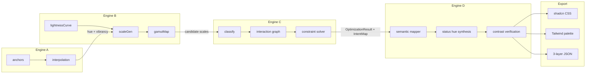
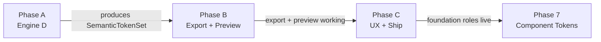

# V2 Product Plan — From Palette Tool to Colour System Product

> **Archived.** Phases A–C are shipped. The active planning doc is [V2-UX-OVERHAUL.md](../V2-UX-OVERHAUL.md) (Phase D — UX overhaul, onboarding, and input model expansion).

> Turn the v1 palette engine into a shippable product that outputs production-ready token libraries immediately usable in shadcn/Tailwind projects, with a multi-surface preview, UX polish, and static deployment.

---

## The Gap

V1 produces raw palette scales (layer 1). V2 bridges to semantic roles (layer 2) — purpose-based tokens like `background.canvas`, `text.primary`, `accent.primary`, `status.error` — and outputs a complete token set that plugs directly into shadcn/Tailwind. Layer 3 (component tokens) is implemented in Phase 7.

The three-layer model from [misc/color-token-architecture.md](../misc/color-token-architecture.md):

| Layer | What it is | V1 → V2 |
|---|---|---|
| 1. Reference palette | Raw colour inventory | Built |
| 2. Semantic roles | Purpose-based tokens | **V2 target** |
| 3. Component tokens | Executable UI | **Phase 7 — started** |

---

## Pipeline

---

## Sub-Projects

V2 is split into four phased sub-projects. Each is a self-contained brief with its own spec, tests, and acceptance criteria.

| Phase | File | Scope |
|---|---|---|
| A | [V2-ENGINE-D.md](V2-ENGINE-D.md) | Semantic mapper engine — intent-driven mapping rules, status hue synthesis, store integration, Engine D tests |
| B | [V2-EXPORT-PREVIEW.md](V2-EXPORT-PREVIEW.md) | Export pipeline (shadcn, Tailwind, JSON) + multi-surface token preview + export tests |
| C | [V2-UX-SHIP.md](V2-UX-SHIP.md) | Progressive disclosure, production readiness checklist, deployment to Vercel |
| 7 | `src/engine-d/component-tokens.ts` | Component token derivation — button, input, nav states derived from foundation roles via offset rules |

---

## Future Phases

### Phase 7 — Component Tokens *(implementation started — see `src/engine-d/component-tokens.ts`)*

Define concrete offset rules for deriving component tokens from foundation roles:

| Component token | Derivation |
|---|---|
| `button.primary.hover-bg` | Accent hue at one lightness step lighter than `accent.primary` |
| `button.primary.active-bg` | Accent hue at one lightness step darker |
| `button.primary.disabled-bg` | Accent hue at `container`-intent lightness, chroma halved |
| `button.primary.disabled-fg` | `text.disabled` |
| `button.primary.focus-ring` | `focus.ring` |
| `button.secondary.bg` | `background.surface-inset` |
| `button.secondary.hover-bg` | Next-lighter `container`-intent neutral |
| `input.bg` | `background.surface` |
| `input.border` | `border.subtle` |
| `input.focus-border` | `accent.primary` |
| `input.focus-ring` | `focus.ring` |
| `input.invalid-border` | `status.error` |
| `nav.item.hover-bg` | `background.accent-subtle` |
| `nav.item.selected-bg` | `accent.primary` at reduced chroma |
| `nav.item.selected-fg` | `accent.primary-foreground` |

Full inventory from [misc/color-token-architecture.md](../misc/color-token-architecture.md).

### Phase 8 — iOS Export

- SwiftUI `Color` extensions with light/dark adaptive variants
- UIKit `UIColor` dynamic provider blocks
- Named colour asset catalog JSON
- Map semantic roles to Apple's hierarchy (`label`, `secondaryLabel`, `systemBackground`, etc.) per [misc/apple-color-system.md](../misc/apple-color-system.md) and [misc/apple-color-implementation.md](../misc/apple-color-implementation.md)

### Phase 9 — Additional Export Targets

- Android Material 3 dynamic colour
- Figma Variables (JSON import format)
- Style Dictionary compatible output

---

## References

### Colour Science
- [docs/01 — OKLCH Colour Model](../docs/01-oklch-colour-model.md)
- [docs/02 — Contrast & Compliance](../docs/02-contrast-compliance.md)
- [docs/03 — Gamut Mapping](../docs/03-gamut-mapping.md)
- [docs/04 — Scale Design](../docs/04-scale-design.md)
- [docs/05 — Generation Algorithm](../docs/05-generation-algorithm.md)
- [docs/06 — Token Intent & Optimization](../docs/06-token-intent.md)

### Source-of-Truth Docs (misc/)
- [misc/color-token-architecture.md](../misc/color-token-architecture.md) — 3-layer model, foundation + component role inventories
- [misc/shadcn-semantic-tokens.md](../misc/shadcn-semantic-tokens.md) — exact CSS variable names and semantics
- [misc/surface-and-text-color.md](../misc/surface-and-text-color.md) — surface hierarchy, text roles, contrast floors
- [misc/dark-mode-color.md](../misc/dark-mode-color.md) — luminance ladder, elevation, saturation restraint
- [misc/component-state-color.md](../misc/component-state-color.md) — interactive states, status semantics
- [misc/gradient-and-review-checklist.md](../misc/gradient-and-review-checklist.md) — production readiness checklist

### Frameworks
- [frameworks/FRAMEWORK_Psych-BIAS.md](../frameworks/FRAMEWORK_Psych-BIAS.md)
- [frameworks/FRAMEWORK_Onboarding-Principles.md](../frameworks/FRAMEWORK_Onboarding-Principles.md)
- [frameworks/FRAMEWORK_Journey-Mapping.md](../frameworks/FRAMEWORK_Journey-Mapping.md)
- [frameworks/FRAMEWORK_6P-Story.md](../frameworks/FRAMEWORK_6P-Story.md)

### Implementation
- Engine C types: [src/engine-c/types.ts](../src/engine-c/types.ts) (extend `OptimizationResult`)
- Engine C entry: [src/engine-c/index.ts](../src/engine-c/index.ts) (expose `intents`)
- Engine C intent bands: [src/engine-c/intent.ts](../src/engine-c/intent.ts) (classification source)
- Current export: [src/lib/export.ts](../src/lib/export.ts) (extend with shadcn/Tailwind/JSON)
- Current preview: [src/components/TokenPreview.tsx](../src/components/TokenPreview.tsx) (replace with multi-surface)
- Store: [src/store/index.ts](../src/store/index.ts) (add `semanticTokens` / `darkSemanticTokens`)
